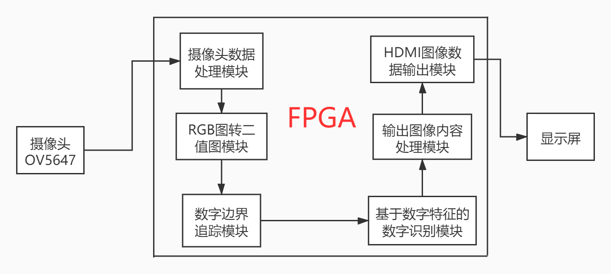
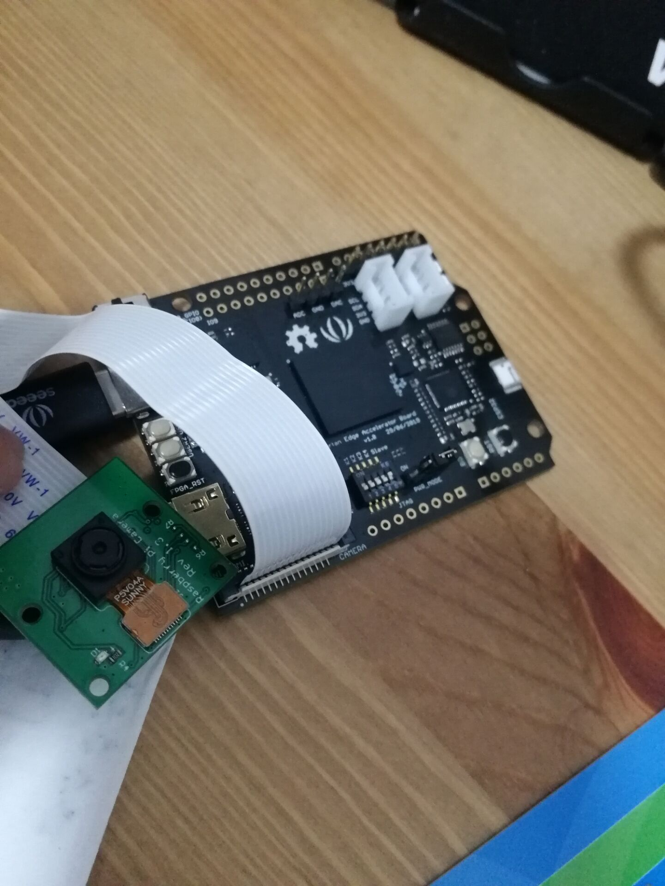

# 2020年新工科联盟-Xilinx暑期学校项目介绍

## 项目概要

项目名称：数字识别

项目内容：实现0-9的数字识别，用摄像头捕捉数据于限定的框内，自动识别出数字的边框，然后通过数字特征算法实现数字的识别，并将识别的结果输出在LCD屏幕上。在简单数字识别的基础上，进一步拓展，实现10以内数字的简单加减乘运算，并将识别出的数字和运算符以及最后的运算结果输出在屏幕上。

相关知识：摄像头及miniHDMI转HDMI外设驱动的调用及有效信息的获取与输出、数字边界追踪算法和基于数字特征的数字识别算法、基于FPGA的编程实现

项目框图：

## 技术方向

本项目的核心是将摄像机捕获的照片信息里的数字内容提取出来并加以识别。首先是需要调用摄像头相关驱动，获取图像的有效信息，再将其转化为RGB图像，进一步转化为灰度图并二值化。接着对二值化后的图像处理，利用边界追踪算法捕获数字的边框，再利用基于数字特征的数字识别算法进行数字识别。然后编写输出图像内容的模块，自定义输出内容（识别出的数字边框及数字信息）与形式。最后调用HDMI驱动将制定好的输出内容输出到显示屏上。

## 已实现功能

在一定的范围内实现了任意位置和大小的数字的边缘追踪和数字识别，并能将数字的边框展现在屏幕上的数字处，将识别出的数字信息展示在屏幕的右上角。

## 演示视频

<video id="video" controls="" preload="none">     <source id="mp4" src="images/demo.mp4" type="video/mp4"> </video>

（视频为image文件夹中的demo.mp4）

## 使用的工具版本

Vivado2018.3

Arduino1.8.13

## 小组成员列表

| 组长   | 组员   |
| ------ | ------ |
| 周昀政 | 王健宇 |

## 板卡型号与外设列表

板卡型号：xc7s15ftgb196-1

外设列表：摄像头OV5647，miniHDMI转HDMI线，LCD显示屏

## 仓库目录介绍

### images

存放了本次项目的成品照片，在“作品照片”中展示。

### Sourcecode

存放了项目的Vivado工程，具体代码分析见文件夹中的README.md文件。

### Executable

存放了能下载到板卡使用的FPGA比特流文件。

## 作品照片

